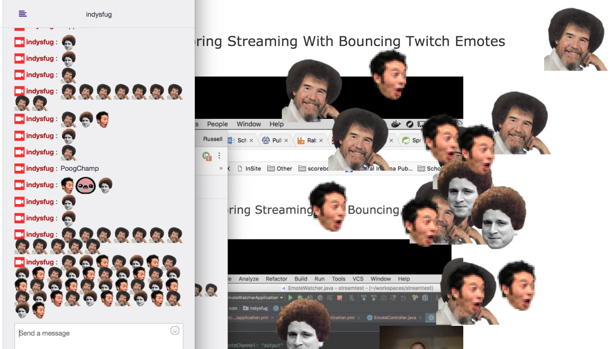

# Spring Cloud Stream Example

Leverages Spring Cloud Stream to process Twitch chat messages

## What does it do?

`chatbot` connects to Twitch channel and acts as a `Source` broadcasting messages

`chattingusers` acts as a `Sink` by listening to messages and aggregating all usernames that have sent a message

`emotewatcher` listens to messages and rebroadcasts all Emotes to another topic. That topic is then listened to so that we can broadcast to SSE streams for web clients - Plus a bonus UI viewer with bouncing Twitch Emotes. Kappa GG WP


## Running the example

This assumes you have Docker installed. This command will build and run all pieces of the system including RabbitMQ

First: Modify the .env file to contain the proper nick/channel/auth for your bot

``` bash
$ ./mvnw clean package
$ docker-compose up
```
